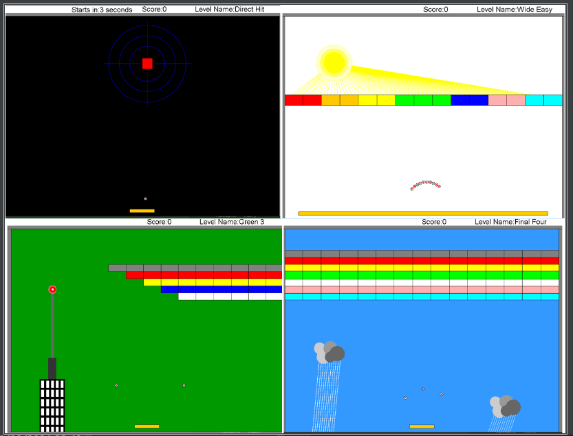

# Arkanoid Game
A fun and engaging Arkanoid game developed using Java, OOP principles, design patterns, and a GUI.
#
# Prerequisites For The Game
In order to run the game you need to install the following software on your computer:
- Java SE Development Kit 8 or later
- Ant build tool
# How To Run And Compile
1. Download to your computer all the project's files and put them in the same directory.
2. Open the terminal in the path of the directory you inserted all the files.
3. Use the following run and compile line : "ant run"
# How To Play
Use the left and right arrow keys to move the paddle. Your goal is to hit all the blocks with the balls and progress to the next level. The game has four levels in total. Good luck!
#

